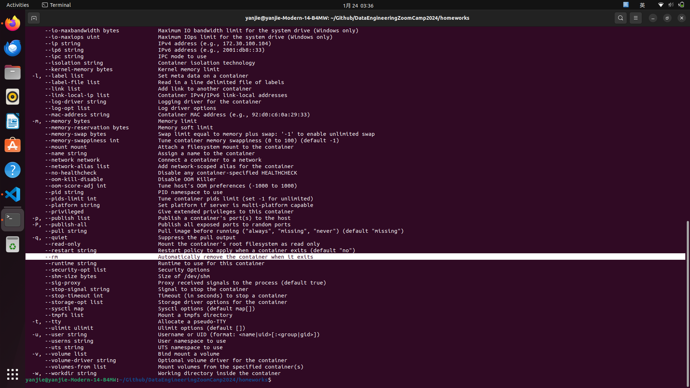

# The solution of homework_1
## Question 1. Knowing docker tags
* What I do  
execte the command `docker run --help` on bash

* What I get  
```
--rm                               Automatically remove the container when it exits
```


## Question 2. Understanding docker first run
* What I do  
Run the command on bash `docker run --it --entrypoint=bash python:3.9`. The parameter `--it` is the combine of `run --interactive`  and `run --tty` see(1).  
Ref:  
(1) [docker run office document](https://docs.docker.com/engine/reference/commandline/container_run/)  

* What I get  
```
Package    Version
---------- -------
pip        23.0.1
setuptools 58.1.0
wheel      0.42.0
```

## Set up the database
Run the command on bash to build the container  
```
docker run -it \
  -e POSTGRES_USER="root" \
  -e POSTGRES_PASSWORD="root" \
  -e POSTGRES_DB="ny_taxi" \
  -v $(pwd)/ny_taxi_postgres_data:/var/lib/postgresql/data \
  -p 5432:5432 \
  postgres:13
```
Change the permission of the folder `sudo chmod a+rwx ny_taxi_postgres_data`  

some warning  
```
  WARNING: The script tabulate is installed in '/home/usr/.local/bin' which is not on PATH.
  Consider adding this directory to PATH or, if you prefer to suppress this warning, use --no-warn-script-location.
  WARNING: The script sqlformat is installed in '/home/usr/.local/bin' which is not on PATH.
  Consider adding this directory to PATH or, if you prefer to suppress this warning, use --no-warn-script-location.
  WARNING: The script pygmentize is installed in '/home/usr/.local/bin' which is not on PATH.
  Consider adding this directory to PATH or, if you prefer to suppress this warning, use --no-warn-script-location.
  WARNING: The script pgcli is installed in '/home/usr/.local/bin' which is not on PATH.
  Consider adding this directory to PATH or, if you prefer to suppress this warning, use --no-warn-script-location.
```

`pglic: command not found`

Run the command on the bash `echo 'export PATH=/home/usr/.local/bin:$PATH' >> ~./bashrc` and `source ~./bashrc`  

OK we can run the `pglic` command, but another error appeared
```
ImportError: no pq wrapper available.
Attempts made:
- couldn't import psycopg 'c' implementation: No module named 'psycopg_c'
- couldn't import psycopg 'binary' implementation: No module named 'psycopg_binary'
- couldn't import psycopg 'python' implementation: libpq library not found
```

We neet to install the `psycopg` package see(2).  
(2)[stack overflow ImportError "no pq wrapper available" when importing psycopg3](https://stackoverflow.com/questions/72112754/importerror-no-pq-wrapper-available-when-importing-psycopg3)

For using `sqlalchemy`, it depends on the `psycopg2`.  
When I install psycopg2 by `pip install psycopg2`, the error messeage appeared  
```
Error: pg_config executable not found.

pg_config is required to build psycopg2 from source.  Please add the directory ......   
```

Run this command to solve `sudo apt-get install libpq-dev`  
see[pg_config executable not found](https://stackoverflow.com/questions/11618898/pg-config-executable-not-found)

Run postgresql in detached mode
```
docker run -d \
  -e POSTGRES_USER="root" \
  -e POSTGRES_PASSWORD="root" \
  -e POSTGRES_DB="ny_taxi" \
  -v $(pwd)/ny_taxi_postgres_data:/var/lib/postgresql/data \
  -p 5432:5432 \
  postgres:13
```

## Question 3. Count records
Run the SQL with the table green_taxi_data created before

```sql
SELECT count(1) FROM public.green_taxi_data
WHERE lpep_pickup_datetime>='2019-09-18 00:00:00' AND lpep_dropoff_datetime<='2019-09-18 23:59:59'

# OUTPUT > 15612
```

## Question 4. Largest trip for each day

```sql
SELECT MAX(trip_distance) FROM public.green_taxi_data
WHERE lpep_pickup_datetime>='2019-09-18 00:00:00' AND lpep_dropoff_datetime<='2019-09-18 23:59:59'

# OUTPUT > 2019-09-18, max distance is 70.28
```

```sql
SELECT MAX(trip_distance) FROM public.green_taxi_data
WHERE lpep_pickup_datetime>='2019-09-16 00:00:00' AND lpep_dropoff_datetime<='2019-09-16 23:59:59'

# OUTPUT > 2019-09-16, max distance is 114.3
```

```sql
SELECT MAX(trip_distance) FROM public.green_taxi_data
WHERE lpep_pickup_datetime>='2019-09-26 00:00:00' AND lpep_dropoff_datetime<='2019-09-26 23:59:59'

# OUTPUT > 2019-09-26, max distance is 35.62
```

```sql
SELECT MAX(trip_distance) FROM public.green_taxi_data
WHERE lpep_pickup_datetime>='2019-09-21 00:00:00' AND lpep_dropoff_datetime<='2019-09-21 23:59:59'
# OUTPUT > 2019-09-26, max distance is 135.53
```

ans is 2019-09-26

## Question 5. Three biggest pick up Boroughs

The column name's data type is CHAR, so it is nesseary to take double quotes.  
e.x. `zone_lookup."Borough"` 
```sql
SELECT
    zone_lookup."Borough",
    SUM(green_taxi_data."total_amount") AS total_amount_sum
FROM
    green_taxi_data
JOIN
    zone_lookup ON zone_lookup."LocationID"=green_taxi_data."PULocationID"
WHERE
	green_taxi_data.lpep_pickup_datetime::date='2019-09-18' AND
 	zone_lookup."Borough" IN ('Bronx', 'Brooklyn', 'Manhattan', 'Queens', 'Staten Island')
GROUP BY
    zone_lookup."Borough";

"Location" "total_amount_sum"
"Bronx"	32830.08999999992
"Brooklyn"	96333.24000000009
"Manhattan"	92271.29999999973
"Queens"	78671.70999999909
"Staten Island"	342.59000000000003
```

## Question 6. Largest tip
```sql
SELECT 
	dropoff."Zone" AS dropoff_zone, MAX(tip_amount) AS max_tip
FROM 
	green_taxi_data AS taxi
JOIN 
	zone_lookup AS pickup ON taxi."PULocationID" = pickup."LocationID"
JOIN 
	zone_lookup AS dropoff ON taxi."DOLocationID" = dropoff."LocationID"
WHERE 
	pickup."Zone" = 'Astoria'
GROUP BY 1
ORDER BY max_tip DESC

OUTPUT >
"JFK Airport"	62.31
"Woodside"	30
"Kips Bay"	28
```

## Set Up of Terraform

download on the [office site](https://developer.hashicorp.com/terraform/install) by following command
```bash
wget -O- https://apt.releases.hashicorp.com/gpg | sudo gpg --dearmor -o /usr/share/keyrings/hashicorp-archive-keyring.gpg
echo "deb [signed-by=/usr/share/keyrings/hashicorp-archive-keyring.gpg] https://apt.releases.hashicorp.com $(lsb_release -cs) main" | sudo tee /etc/apt/sources.list.d/hashicorp.list
sudo apt update && sudo apt install terraform
```

## Question 7. Creating Resources

```bash
terraform apply
google_bigquery_dataset.dataset: Refreshing state... [id=projects/corded-streamer-412604/datasets/my_bq_dataset]

Terraform used the selected providers to generate the following execution plan. Resource actions are indicated with the following symbols:
  + create

Terraform will perform the following actions:

  # google_storage_bucket.data-lake-bucket will be created
  + resource "google_storage_bucket" "data-lake-bucket" {
      + effective_labels            = (known after apply)
      + force_destroy               = true
      + id                          = (known after apply)
      + location                    = "ASIA-EAST1"
      + name                        = "my_unique_bucket-a-good-day"
      + project                     = (known after apply)
      + public_access_prevention    = (known after apply)
      + self_link                   = (known after apply)
      + storage_class               = "STANDARD"
      + terraform_labels            = (known after apply)
      + uniform_bucket_level_access = (known after apply)
      + url                         = (known after apply)

      + lifecycle_rule {
          + action {
              + type = "AbortIncompleteMultipartUpload"
            }
          + condition {
              + age                   = 1
              + matches_prefix        = []
              + matches_storage_class = []
              + matches_suffix        = []
              + with_state            = (known after apply)
            }
        }
    }

Plan: 1 to add, 0 to change, 0 to destroy.

Do you want to perform these actions?
  Terraform will perform the actions described above.
  Only 'yes' will be accepted to approve.

  Enter a value: yes

google_storage_bucket.data-lake-bucket: Creating...
google_storage_bucket.data-lake-bucket: Creation complete after 2s [id=my_unique_bucket-a-good-day]

Apply complete! Resources: 1 added, 0 changed, 0 destroyed.

```